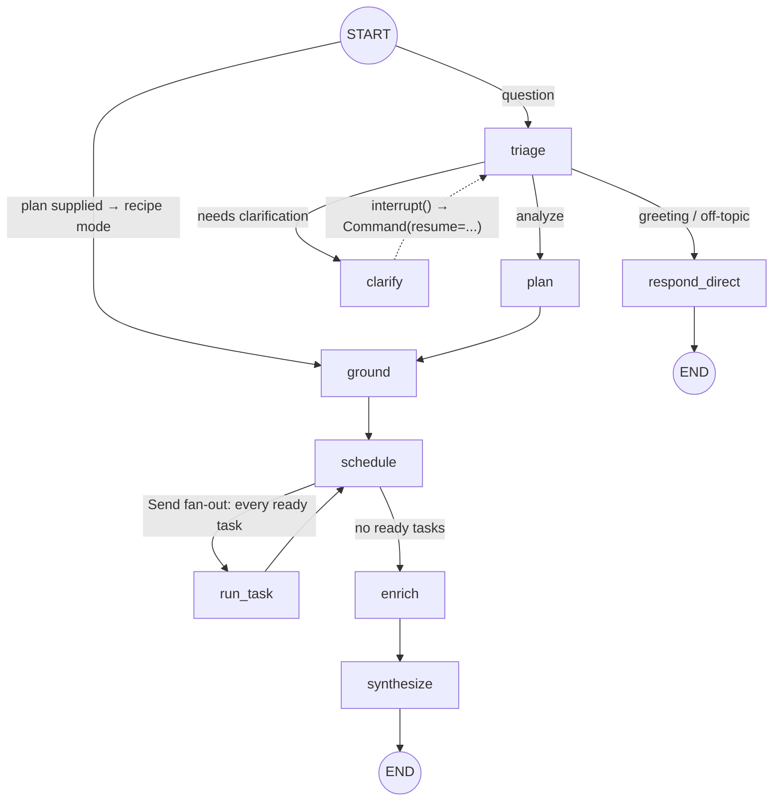
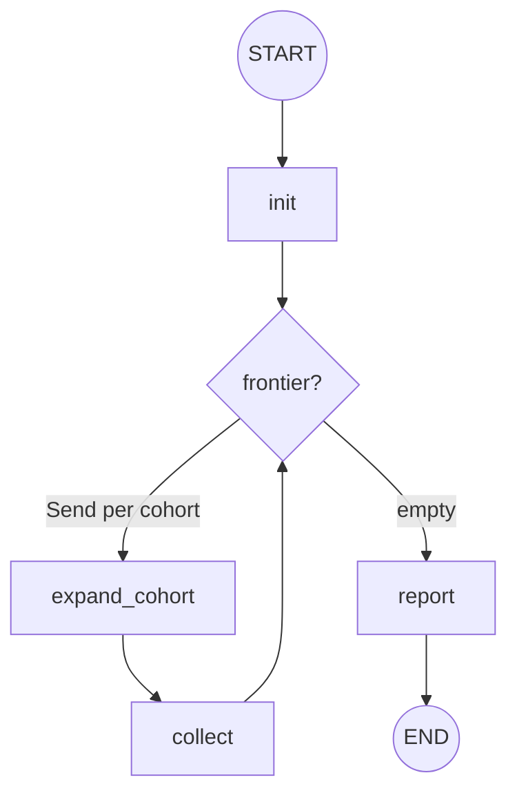

# growth-copilot

**Plain-English product-analytics questions in — auditable, dependency-aware task graphs out, executed in parallel against an embedded DuckDB warehouse. Built LangGraph-native.**

[](https://github.com/HassaanSaleem/growth-copilot/actions/workflows/ci.yml)
[](pyproject.toml)
[](LICENSE)

```
$ growth-copilot ask "why do users who upload files never upgrade?"
```

The copilot triages the question, plans the smallest task DAG that answers it, corrects any
hallucinated event names against warehouse metadata, executes independent tasks in parallel,
auto-compares cohorts, and writes a quantified answer — streaming every step as it happens. The
plan itself is JSON you can read, diff, save, and re-run without an LLM.

## Why this exists

This is a class of system I have built and run in production: an LLM orchestrator that turns
natural-language questions from growth teams into dependency-aware task DAGs executed over a
warehouse, with step-level checkpointing, session resume, clarifying-question pauses, and a
live progress feed. Systems like that predate the current agent frameworks, so all of the
machinery — scheduling, checkpointing, interrupts, streaming — ends up hand-rolled.

This repo is the greenfield counterfactual: the same architecture, built from scratch the way
I would build it **LangGraph-native today** — every piece of hand-rolled machinery replaced by
the primitive that should own it, running against a synthetic warehouse so the whole system is
reproducible on a laptop. Patterns only — no code, data, or names from anything I have
operated professionally.

| Hand-rolled pattern | LangGraph-native rebuild (here) | Where |
|---|---|---|
| Dynamic DAG execution — run every task whose dependencies are done, in parallel | `Send` fan-out from a barrier-node router, re-evaluated each superstep | `graph/nodes.py` (`route_schedule`) |
| Step-checkpointed session resume | `SqliteSaver` + deterministic thread ids (hash of the question) | `graph/build.py` |
| Clarifying-question pauses mid-run | a dedicated `clarify` node whose first statement is `interrupt()` (deterministic replay) / `Command(resume=...)` | `graph/nodes.py` (`clarify`), `cli.py` |
| Out-of-band progress bus feeding a UI | custom stream writer → CLI renderer and SSE endpoint | `graph/nodes.py`, `api.py` |
| Recursive bottleneck drill-down tree — the shape that breaks static graphs | frontier/collect work-queue subgraph | `graph/drilldown.py` |
| LLM-arg hallucination on event/property names | deterministic grounding against warehouse metadata, difflib ≥ 0.9 | `grounding.py` |
| SME-editable JSON recipes — new analysis without a deployment | `Recipe` / `Plan` pydantic contracts with `$param` and `$ref` | `domain/tasks.py` |

The deeper rationale for each choice is in [docs/architecture.md](docs/architecture.md).

## The graph



`schedule ⇄ run_task` is Kahn's algorithm expressed as graph supersteps: each pass fans out the
tasks whose dependencies are complete, results merge through a state reducer, and the router
re-evaluates. A task that fails becomes an error *result* — siblings keep running and downstream
tasks receive the failure as data.

The recursive bottleneck drill-down is its own subgraph (`growth-copilot drilldown`), because its
analysis tree isn't known until execution — each cohort's funnel decides whether to recurse:



## Quickstart

Works with **no API key** — recipes are fully deterministic:

```bash
git clone https://github.com/HassaanSaleem/growth-copilot.git
cd growth-copilot
pip install -e .

growth-copilot seed                        # build the synthetic warehouse (deterministic)
growth-copilot recipes                     # list saved analyses
growth-copilot recipe conversion-blockers  # full run: funnel → cohort export → profiles → auto-comparison
```

Then add a key for LLM planning and synthesis:

```bash
export ANTHROPIC_API_KEY=sk-ant-...
growth-copilot ask "why do users who upload files never upgrade?"
```

More to try:

```bash
growth-copilot recipe weekly-health -p funnel_days=14      # override recipe params
growth-copilot drilldown --depth 2                         # recursive bottleneck drill-down (no key needed)
growth-copilot serve                                       # HTTP API — same event feed over SSE
```

Every run streams its progress live — `triage`, `plan` (the full task table), `grounding`
corrections, `task_started` / `task_finished`, `finding`, `answer` — from the graph's custom
stream writer. `growth-copilot serve` exposes the identical feed as Server-Sent Events
(`POST /ask`, `POST /recipes/{name}/run`), plus `GET /catalog` and `GET /recipes`.

## Run with Docker

```bash
docker compose --profile demo run --rm demo    # offline demo: seed ./data + conversion-blockers recipe, no key
docker compose up api                          # HTTP API on http://localhost:8000
curl -N -X POST localhost:8000/recipes/conversion-blockers/run \
  -H 'content-type: application/json' -d '{"params": {}}'
```

The `api` service passes `ANTHROPIC_API_KEY` through from your shell (leave it unset and the
recipe endpoints still work), and both services mount `./data` so the DuckDB warehouse the demo
seeds is the one the API serves — and it persists across containers. To build and run the image
directly:

```bash
docker build -t growth-copilot .
docker run --rm -p 8000:8000 -v ./data:/app/data growth-copilot
```

## The synthetic warehouse

`growth-copilot seed` builds a DuckDB warehouse for **Relay**, a fictional team file-sharing
SaaS — 20,000 users and 120 days of event history by default, generated from a fixed RNG seed,
so every clone produces identical data and every run is reproducible.

The journey is deliberately **non-linear**: users reach value through two independent routes
that interleave freely — a solo route (`workspace_created` → `file_uploaded` → `link_shared`)
and a team route (`teammate_invited` → `teammate_joined` → `comment_added`) — and upgrades are
usage-driven (`storage_limit_reached` → `plan_upgraded`), not the tail of a fixed onboarding
sequence. User profiles carry `plan`, `country`, `device`, `channel`, and company-size
properties.

The data is not uniform noise. The seeder **plants causal effects** — cohorts with genuinely
depressed upload activation, behaviors that actually separate upgraders from
non-upgraders — declared explicitly in the seeder source (`src/growth_copilot/warehouse/`)
rather than emerging from randomness. That makes the copilot *verifiable*, not just demoable:
read the planted ground truth, run `growth-copilot recipe conversion-blockers` or
`growth-copilot drilldown`, and check that what it reports is what was planted.

## Design principles

- **Failures are data.** A task that raises becomes an `execution_error` result; siblings keep
  running, downstream tasks see the error as input, and synthesis acknowledges the gap instead
  of papering over it.
- **LLM for judgment, code for truth.** Planning and narration are LLM calls; scheduling,
  grounding, cohort comparison, and every number in the answer are deterministic code.
- **The plan is the product.** The task graph is JSON — auditable before execution, diffable in
  review, re-runnable as a saved recipe. Adding an analysis is a JSON edit, not a deployment.
- **Aggregates only leave the warehouse.** Tools return counts, rates, lifts, and paths — never
  row-level data. The LLM sees statistics, not users.

## Models

Everything defaults to `claude-opus-4-8`; each stage can be re-pointed independently via
environment variables (see `.env.example`):

| Variable | Stage | Default |
|---|---|---|
| `GROWTH_COPILOT_MODEL` | all stages | `claude-opus-4-8` |
| `GROWTH_COPILOT_TRIAGE_MODEL` | triage | falls back to `GROWTH_COPILOT_MODEL` |
| `GROWTH_COPILOT_PLANNER_MODEL` | planner | falls back to `GROWTH_COPILOT_MODEL` |
| `GROWTH_COPILOT_SYNTHESIS_MODEL` | synthesis | falls back to `GROWTH_COPILOT_MODEL` |

Cost note: triage is a small classification call — set
`GROWTH_COPILOT_TRIAGE_MODEL=claude-haiku-4-5` to cut its cost substantially while keeping the
big model where judgment matters (planning and synthesis).

## Project layout

```
src/growth_copilot/
├── cli.py              # seed / ask / recipe / recipes / drilldown / serve
├── api.py              # FastAPI: the same event feed over SSE
├── config.py           # env-driven settings; safe local defaults, no hardcoded secrets
├── llm.py              # per-stage model resolution; returns None offline
├── prompts.py          # prompts are files, not string literals
├── catalog.py          # tool catalog loader — the planner's affordance spec
├── grounding.py        # difflib correction of planned args vs warehouse metadata
├── domain/
│   ├── tasks.py        # Task / Plan / Recipe pydantic contracts ($param, $ref)
│   └── state.py        # CopilotState TypedDict + merge/append reducers
├── graph/
│   ├── build.py        # graph wiring + deterministic thread ids
│   ├── nodes.py        # triage / plan / ground / schedule / run_task / enrich / synthesize
│   ├── scheduler.py    # Kahn's algorithm: level batches + incremental ready set
│   ├── binding.py      # late binding of $ref args to upstream results
│   └── drilldown.py    # recursive bottleneck drill-down work-queue subgraph
├── warehouse/          # DuckDB: seeder, tool implementations, metadata catalog
└── resources/
    ├── catalog.json    # SME-editable tool catalog (8 analytics tools)
    ├── prompts/        # triage / planner / synthesize
    └── recipes/        # conversion-blockers · upgrade-paths · weekly-health
```

## Testing & CI

The test suite is **fully offline** — no API key, no network. Everything that doesn't require
LLM judgment (grounding, scheduling, binding, the full recipe execution path, the drill-down
subgraph) runs against the deterministic warehouse, which is exactly what CI does on Python
3.11 and 3.12:

```bash
pip install -e ".[dev]"
ruff check src tests
pytest
```

## Roadmap

- **Two-level planning** — a macro planner decomposing broad questions into sub-analyses, each
  a micro-planned subgraph; the current graph becomes the inner loop.
- **More warehouses** — the seam is now explicit: `WarehouseRepository`
  (`warehouse/repository.py`) is a Protocol capturing exactly what the graph asks of a
  warehouse, and the DuckDB module satisfies it as-is. A client-server backend is one adapter
  away — implement those four members; the graph never sees SQL. A natural target already
  exists: [relay-events-platform](https://github.com/HassaanSaleem/relay-events-platform),
  an event pipeline that lands the same kind of clickstream into Postgres with funnel views —
  an adapter over its schema is the planned next step.
- **LangSmith tracing** — the run is already fully observable through state; wiring traces in
  makes the plan → grounding → execution → synthesis chain inspectable per thread.

## License

MIT — see [LICENSE](LICENSE).
